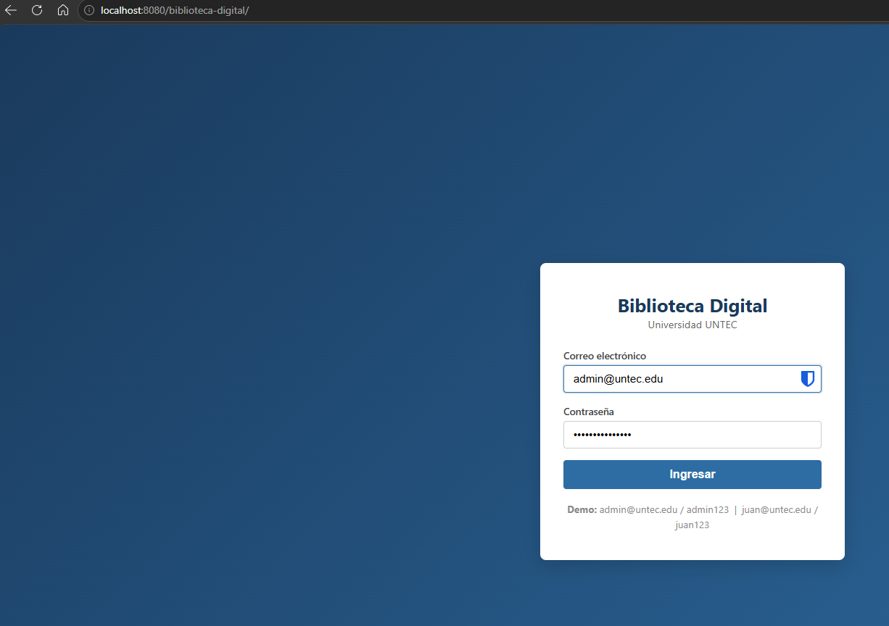
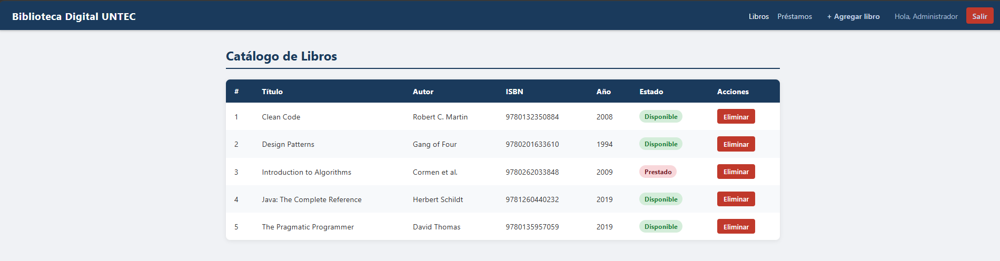
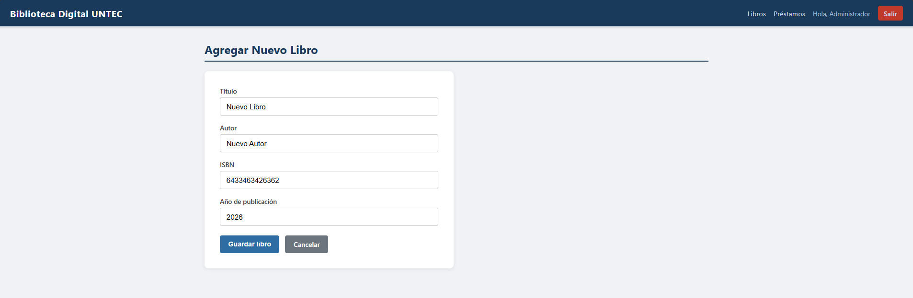
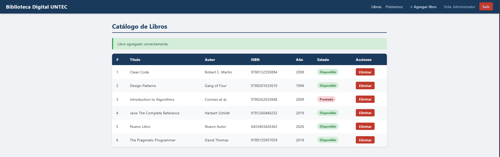
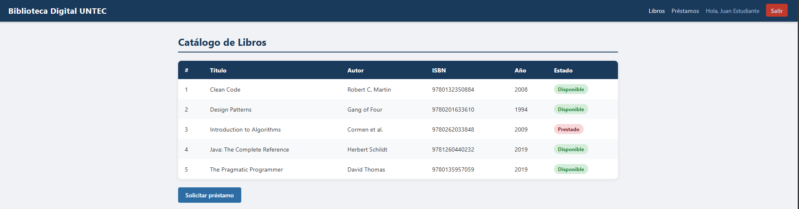
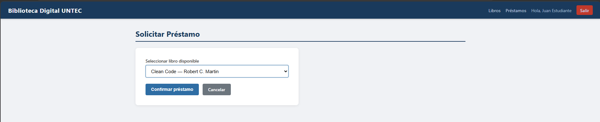
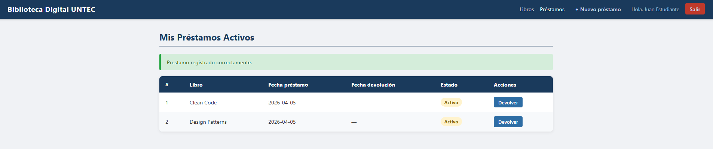

# Biblioteca Digital UNTEC

Aplicación web dinámica desarrollada con Java EE (JSP, Servlets, JSTL, JDBC) siguiendo el patrón MVC.

## Tecnologías

| Capa | Tecnología |
|---|---|
| Vista | JSP + JSTL + HTML/CSS |
| Controlador | Java Servlets (javax.servlet) |
| Modelo / DAO | Java + JDBC |
| Base de datos | H2 (embebida, sin instalación) |
| Servidor | Apache Tomcat 11 |
| Build | Maven (WAR) |

## Estructura del proyecto (MVC)

```
src/main/java/com/untec/biblioteca/
├── model/          ← Entidades: Libro, Usuario, Prestamo
├── dao/            ← Acceso a datos: LibroDAO, UsuarioDAO, PrestamoDAO, ConexionDB
└── controller/     ← Servlets: LoginServlet, LibroServlet, PrestamoServlet, LogoutServlet

src/main/webapp/
├── index.jsp               ← Login
├── css/style.css
└── WEB-INF/
    ├── web.xml
    └── views/
        ├── libros.jsp
        ├── libro-form.jsp
        ├── prestamos.jsp
        ├── prestamo-form.jsp
        └── error.jsp
```

## Requisitos previos

- Java JDK 11+
- Apache Maven 3.6+
- Apache Tomcat 9.x

## Compilar y generar el WAR

```bash
mvn clean package
```

El archivo `target/biblioteca-digital.war` estará listo para despliegue.

## Despliegue en Tomcat

1. Copiar `target/biblioteca-digital.war` a la carpeta `webapps/` de Tomcat.
2. Iniciar Tomcat: `bin/startup.bat` (Windows) o `bin/startup.sh` (Linux/Mac).
3. Abrir el navegador en: `http://localhost:8080/biblioteca-digital`

### Alternativa: Tomcat Manager

1. Acceder a `http://localhost:8080/manager`
2. En la sección "Deploy", seleccionar el archivo `.WAR` y desplegar.

## Usuarios de prueba

| Email | Contraseña | Rol |
|---|---|---|
| admin@untec.edu | admin123 | ADMIN |
| juan@untec.edu  | juan123  | ESTUDIANTE |

El rol **ADMIN** puede agregar y eliminar libros, y ver todos los préstamos.  
El rol **ESTUDIANTE** puede solicitar préstamos y ver los suyos propios.

## Base de datos

La base H2 se crea automáticamente en `~/biblioteca-untec.mv.db` al iniciar la aplicación.  
Las tablas y datos de ejemplo se inicializan desde `src/main/resources/schema.sql`.

## Flujo de la aplicación

```
GET /login  → index.jsp (formulario login)
POST /login → LoginServlet → valida credenciales → redirige a /libros

GET /libros          → LibroServlet → libros.jsp (listado)
GET /libros?accion=nuevo  → libro-form.jsp (solo ADMIN)
POST /libros         → guarda nuevo libro → redirige a /libros

GET /prestamos             → PrestamoServlet → prestamos.jsp
GET /prestamos?accion=nuevo → prestamo-form.jsp
POST /prestamos            → registra préstamo → redirige a /prestamos
GET /prestamos?accion=devolver&id=X → registra devolución

GET /logout → invalida sesión → redirige a /login
```








